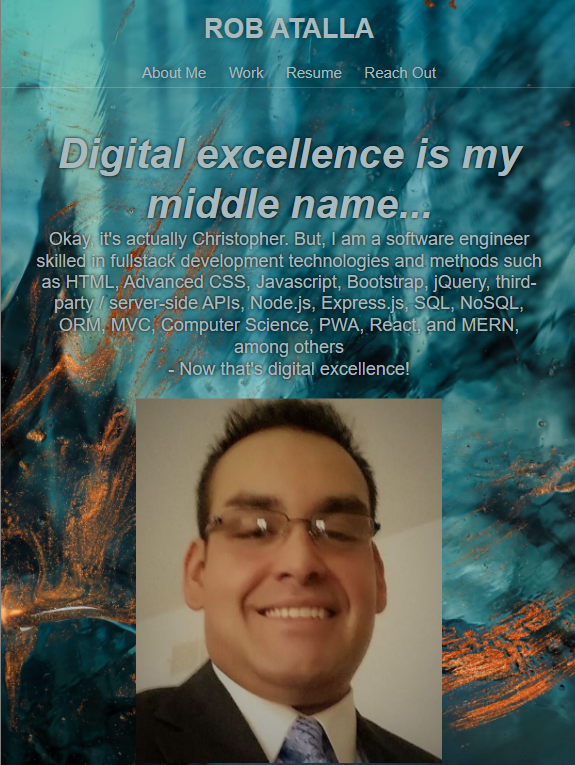

# Professional Portfolio

  
    
  
   
  
   
  
   
  
   
  

Use HTML and CSS to develop a professional portfolio that satisfies a typical hiring manager's needs. 

## Requirements

* When the portfolio is loaded the user is presented with the developer's name, a recent photo, and links to sections about them, their work, and how to contact them. 

* When the navigation links are clicked the UI scrolls to the corresponding section. 

* When the "work" tab is clicked the UI scrolls to a section with titled images of the developer's applications. 

* When the application images are clicked the user is taken to the deployed application. 

* The first application image should be larger in size than the other application images. 

* When the portfolio application is resized or viewed on various screens and devices the user is presented with a responsive layout that adapts to the Viewport Grading Requirements. 

### Deployed Application Link

https://ratalla816.github.io/professional-portfolio/

### Deployed Application Screenshot

#### Acknowledgements

* background art: "Burning Blue" by Jr Korpa, courtesy of unsplash.com https://unsplash.com/photos/YXQew2KZjzY

* RUN BUDDY - KU Coding Bootcamp, Module 2 Activity
 © 2021 Trilogy Education Services, LLC, a 2U, Inc. brand. Confidential and Proprietary. All Rights Reserved.

* SEO-Refactor - KU Coding Bootcamp, Module 1 Challenge Assignment
 © 2021 Trilogy Education Services, LLC, a 2U, Inc. brand Confidential and Proprietary. All Rights Reserved.

#### MIT License

Copyright (c) 2021 Rob Christopher Atalla

Permission is hereby granted, free of charge, to any person obtaining a copy
of this software and associated documentation files (the "Software"), to deal
in the Software without restriction, including without limitation the rights
to use, copy, modify, merge, publish, distribute, sublicense, and/or sell
copies of the Software, and to permit persons to whom the Software is
furnished to do so, subject to the following conditions:

The above copyright notice and this permission notice shall be included in all
copies or substantial portions of the Software.

THE SOFTWARE IS PROVIDED "AS IS", WITHOUT WARRANTY OF ANY KIND, EXPRESS OR
IMPLIED, INCLUDING BUT NOT LIMITED TO THE WARRANTIES OF MERCHANTABILITY,
FITNESS FOR A PARTICULAR PURPOSE AND NONINFRINGEMENT. IN NO EVENT SHALL THE
AUTHORS OR COPYRIGHT HOLDERS BE LIABLE FOR ANY CLAIM, DAMAGES OR OTHER
LIABILITY, WHETHER IN AN ACTION OF CONTRACT, TORT OR OTHERWISE, ARISING FROM,
OUT OF OR IN CONNECTION WITH THE SOFTWARE OR THE USE OR OTHER DEALINGS IN THE
SOFTWARE.